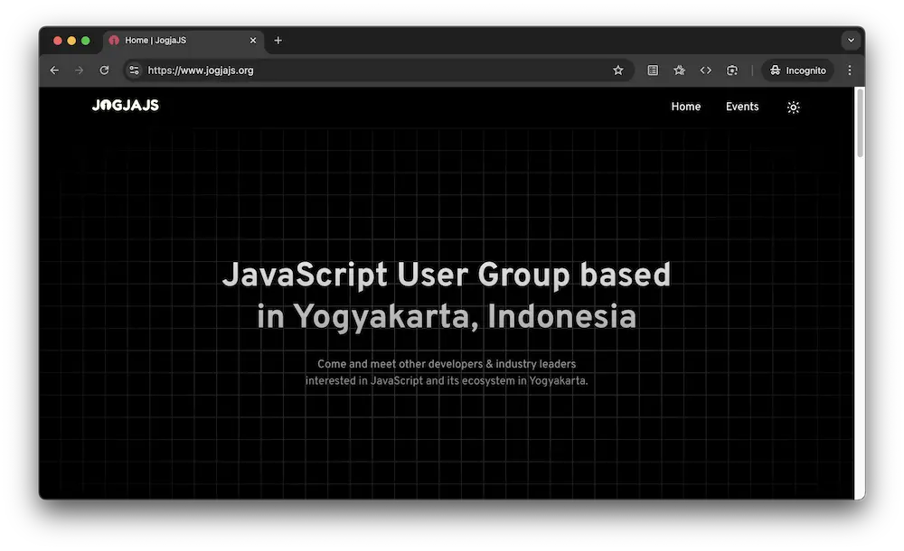
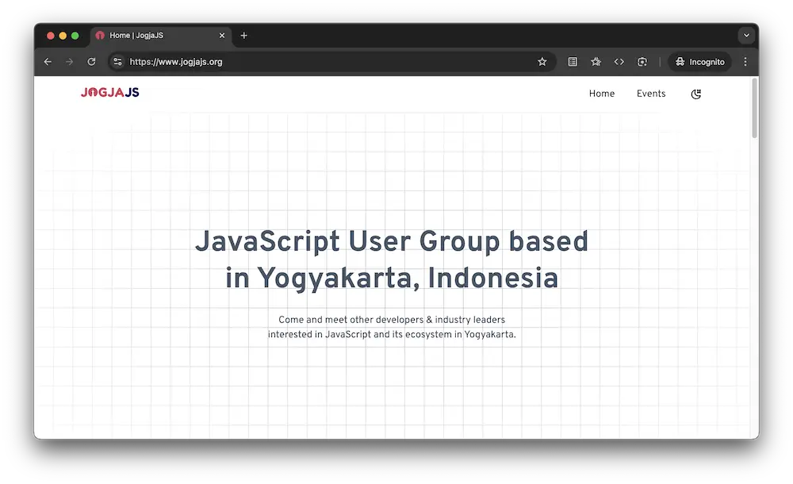

# [jogjajs.org](https://jogjajs.org)

[](https://app.netlify.com/sites/jogjajs/deploys)

JogjaJS Offical Website. Made with SvelteKit, TypeScript, TailwindCSS.





## Getting Started

To get started running the project locally, please follow the steps below.

First, clone the repository.

```bash
git clone https://github.com/jogjajs/jogjajs.org.git
```

Then, install dependencies and fetch data to your local machine. **Note that we use PNPM.**

```bash
cd jogjajs.org
pnpm install
```

Finally, run the development server.

```bash
pnpm dev
```

Open [http://127.0.0.1:5173](http://127.0.0.1:5173) with your browser to see the result.

## Deployment

You can easily deploy to Cloudflare Pages, or you can learn more from https://kit.svelte.dev/docs/adapters.

## Learn More

To learn more about Sveltekit, take a look at the following resources:

- [Svelte Kit Documentation](https://kit.svelte.dev/docs/introduction) - learn about Svelte Kit features and API.
- [Learn Svelte](https://learn.svelte.dev/tutorial/welcome-to-svelte) - an interactive Svelte tutorial.

## License

[MIT](https://choosealicense.com/licenses/mit/)
